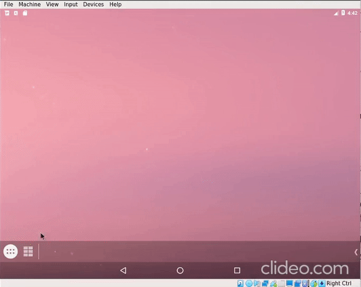

# Intro

Virtual hardware for Androidx86.

Based on Google Sdk qemu. VirtHw run as user space Android service-daemon. It connects to rild via socket. Ril modem emulation supports AT commands handling, like gsm call, sms, ussd reply.

# Usage
Control socket 5545 are available via telnet

 1. gsm call NUM - external call
 2. sms send NUM TEXT - send sms
 3. geo fix ALT LAT - set gps coord

